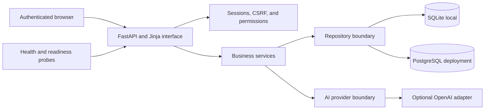

# AI Business Automation Platform Portfolio Case Study

## Project Summary

The AI Business Automation Platform (ABAP) is a tested FastAPI application for
secure employee operations, reusable business workflows, and controlled AI
assistance. It demonstrates how a business application can combine relational
data, role-based access, auditable operations, database portability, and an AI
provider behind clear service boundaries.

ABAP is a portfolio project rather than a hosted commercial service. The
repository contains a reproducible deployment package, but no public production
URL is claimed.

## Business Problem

Small organizations often keep employee data and repeatable processes in
separate spreadsheets, documents, and informal checklists. That makes access
control, process consistency, execution history, and operational ownership hard
to verify.

ABAP brings several of those concerns into one protected workspace:

- Employee records, payroll views, reports, and CSV exports
- Reusable workflows with ordered tasks and lifecycle rules
- Manual execution records with task-level outcomes
- Stored schedules with timezone-aware eligibility and duplicate-run protection
- Reusable AI Agent Templates and a one-off AI Assistant
- User administration, permissions, activity history, and operational probes

## Demonstrable Solution

The application uses server-rendered pages with an accessible Warm Charcoal
interface. Administrators can manage data and controlled operations, while
viewers receive explicitly limited access. Protected requests revalidate the
saved account instead of trusting stale session identity alone.

## Engineering Highlights

### Security and data safety

- Signed, HTTP-only sessions with `SameSite=Lax`; deployment enables
  HTTPS-only cookies and requires a stable secret
- Signed-session CSRF protection for state-changing browser actions
- Default-deny permission checks and active-account revalidation
- PBKDF2 password hashing and generic authentication failures
- Parameterized database operations, foreign keys, transactions, and rollback
- Safe public errors without database URLs, SQL details, credentials, or raw
  provider exceptions
- Success and denial activity logging for sensitive operations

### Workflow and automation design

- Draft, Active, and Inactive workflow lifecycles
- Ordered tasks with transactional resequencing and deletion
- Historical workflow and task snapshots that remain understandable after
  definitions change
- Manual, daily, and weekly schedule rules interpreted in `Asia/Shanghai`
- Five-minute recovery window and unique UTC occurrence claims
- Atomic eligibility rechecks that prevent duplicate scheduled occurrences

Schedules currently prepare and claim due occurrences. An autonomous background
worker that continually executes claimed work is outside the implemented scope.

### AI boundary

- Reusable Agent Templates have reviewable lifecycle states
- Agent executions preserve input, output, status, and safe failure information
- The one-off Assistant does not persist conversations
- Provider construction occurs only after authentication, authorization, CSRF,
  input, and configuration checks
- Tests use deterministic providers and make no paid API calls

### Database and deployment

- SQLite supports local development and the environment-independent test suite
- PostgreSQL supports the production data path through ordered migrations
- Live PostgreSQL tests cover repository, workflow, AI, and readiness paths
- The deployment image pins its base image and resolved Python dependencies,
  runs as a non-root user, and excludes local secrets and data from its context
- Compose waits for PostgreSQL, runs migrations once, starts the web service,
  persists data and logs, and monitors `/ready`
- `/health` reports process liveness independently from `/ready`, which verifies
  the database and shared core schema

## Phase 2 Roadmap Audit

| Planned capability | Status | Evidence or boundary |
| --- | --- | --- |
| Shared ABAP dashboard | Complete | Protected module and resource dashboard |
| Workflow automation | Complete core | Definitions, lifecycle, task ordering, and manual execution |
| Tasks | Complete | CRUD, ordering, snapshots, and outcomes |
| Schedules | Partial | Rules, eligibility, and duplicate-safe claims; no autonomous runner |
| Execution history | Complete | Workflow, task, and Agent Execution records |
| Template-based AI agents | Complete core | Templates, lifecycle, execution, and provider boundary |
| AI assistant | Complete core | Protected one-off assistant; no stored conversations |
| Employee Management System | Complete | Console and protected web operations |
| Leads | Planned | No lead model, storage, service, or interface |
| Customers | Planned | Dashboard card only |
| Invoices | Planned | Dashboard card only |
| Documents | Planned | No document model, storage, or interface |
| Reports and analytics | Complete for workforce | Workforce summaries, payroll analytics, and CSV export |
| Selected API connections | Partial | OpenAI adapter only; no general integration catalog |
| Webhooks | Planned | No inbound or outbound webhook contract |
| Users | Complete | Initial administrator and viewer administration |
| Roles and permissions | Complete core | Administrator/viewer roles and default-deny permissions |
| Activity history | Complete core | Protected application activity log |
| Database backups | Partial | SQLite backup/restore; PostgreSQL uses documented operator tooling |
| System status | Complete | Public liveness and database-readiness endpoints |
| Deployment | Complete package | Locally verified image and Compose stack; no public host or TLS supplied |
| Portfolio documentation | Complete | This case study, audit, demo path, and evidence guide |

This audit defines the honest milestone: the secure automation core is a
portfolio-ready MVP. The broader all-module Phase 2 vision remains incomplete
until the planned business modules and operational gaps above are delivered.

## Verification Evidence

- 619 automated tests ran successfully in the pinned deployment image:
  616 passed and 3 live PostgreSQL tests skipped as designed
- All 3 live PostgreSQL integration tests passed separately
- Four focused deployment tests cover rejected configuration, secure cookies,
  session continuity, and explicit migrations
- A fresh isolated Compose stack completed PostgreSQL startup, migrations, and
  web readiness
- Repeated migrations completed safely
- During a simulated database outage, `/health` stayed at HTTP 200 while
  `/ready` returned a safe HTTP 503, then recovered to HTTP 200
- No real or paid OpenAI request was made during verification

Detailed verification is recorded in
[`Notes/day154_summary.md`](Notes/day154_summary.md). Test commands and deployment
operations are documented in [`README.md`](README.md).

## Suggested Demonstration

Use a local SQLite instance for a quick portfolio demonstration, or the Day 154
Compose deployment for PostgreSQL. Use seeded demonstration data only; do not
show real employee, customer, credential, or API data.

1. Sign in as an administrator and explain the protected shared dashboard.
2. Open Employee Management, show filtering, an employee profile, payroll
   separation, the workforce report, and CSV export.
3. Open Workflow Automation, show a workflow, ordered tasks, lifecycle rules,
   a stored schedule, and execution history with task outcomes.
4. Open Agent Templates, explain Draft review before activation, then show a
   deterministic or previously completed execution without making a paid call.
5. Open the AI Assistant page and explain its authorization and non-persistence
   boundary. A live request is optional and should use an approved test account.
6. Show the administrator-only Users and Activity History pages.
7. Open `/health`, then `/ready`, and explain why deployments need both.
8. Finish with this roadmap matrix and state the unbuilt modules directly.

## What This Project Demonstrates

- Python application design with service and repository boundaries
- FastAPI routes, forms, sessions, templates, validation, and accessibility
- Secure role-based business operations and auditable state changes
- SQLite and PostgreSQL integration with repeatable migrations
- Workflow lifecycle, scheduling rules, and concurrency-aware occurrence claims
- Safe AI-provider integration with deterministic, cost-free tests
- Reproducible container packaging and operational readiness contracts
- Evidence-based project communication that distinguishes implemented behavior
  from planned scope

## Next Development Priorities

1. Add an autonomous scheduler/worker with retry, idempotency, and observability.
2. Implement leads and customers as the next coherent business domain.
3. Add invoices and documents only after customer ownership is established.
4. Define authenticated, replay-safe webhook contracts and an integration audit
   trail before adding external CRM connections.
5. Add PostgreSQL backup automation, restore drills, log rotation, TLS ingress,
   and a public demonstration environment when hosting is approved.
