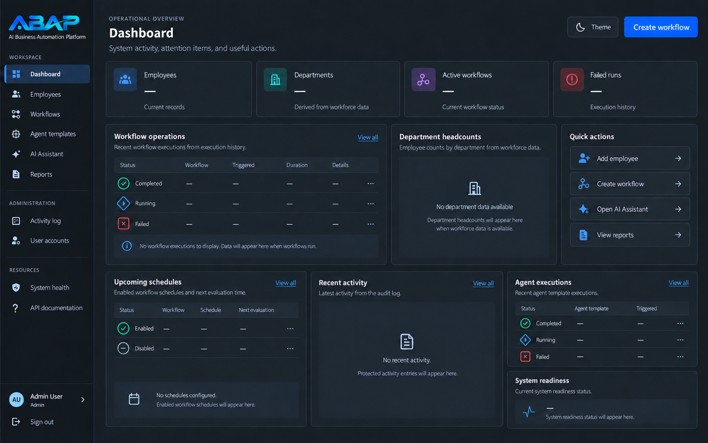

# AI Business Automation Platform

ABAP is a Python business-automation portfolio application. It brings employee
operations, repeatable workflows, role-controlled administration, and optional
AI-assisted work into one protected web workspace. The current application is
a portfolio MVP: its deployment package is documented, but no public
production service or customers are claimed.



*Current dashboard design proposal, using synthetic portfolio content.*

## The problem it explores

Small teams often run people data and recurring processes through spreadsheets,
documents, and informal checklists. ABAP explores a safer, more accountable
approach: controlled employee access, reusable workflows with execution
history, and explicit boundaries around AI and external integrations.

## Major capabilities

- Employee directory, profiles, payroll views, workforce reporting, and CSV
  export, backed by SQLite locally and PostgreSQL for the Compose package.
- Role-based administrator and viewer access, signed sessions, CSRF protection,
  activity logging, and safe browser error handling.
- Workflow definitions, ordered tasks, lifecycle controls, manual executions,
  stored schedules, and duplicate-safe occurrence claims.
- Agent Templates and a one-off AI Assistant behind a provider boundary. The
  optional OpenAI adapter is configured through the environment; tests use
  deterministic providers and do not require paid API calls.
- Health (`/health`) and database-readiness (`/ready`) endpoints, with a
  documented Docker Compose deployment package.

For the detailed implementation boundary and planned work, see the
[portfolio case study](PORTFOLIO.md).

## Architecture and technology

```text
Browser
  -> FastAPI + Jinja templates
  -> authorization, CSRF, and service boundaries
  -> repositories
  -> SQLite (local) / PostgreSQL (Compose deployment)
```

The stack includes Python, FastAPI, Jinja2, SQLite, PostgreSQL, Psycopg,
ItsDangerous signed sessions, HTML/CSS/JavaScript, Docker Compose, and optional
OpenAI integration.

## Engineering and security practices

- Default-deny permissions and active-account revalidation for protected work
- PBKDF2 password hashing, generic authentication failures, and signed
  HTTP-only sessions
- CSRF checks for state-changing browser actions
- Parameterized database access, transactions, and migration tracking
- Activity records for sensitive successes and denials
- Environment-backed secrets excluded from Git; no real secrets or production
  data are needed to run the automated unit suite

These are implementation practices, not a claim of independent security
certification or production readiness.

## Run locally

Use Python with the application dependencies installed. From the repository
root, create a virtual environment and start the FastAPI application:

```powershell
python -m venv .venv
.\.venv\Scripts\python.exe -m pip install -r Projects\employee_management_system\requirements.txt
.\.venv\Scripts\python.exe -m fastapi dev Projects\employee_management_system\web_app.py
```

Open `http://127.0.0.1:8000/` for the web UI, `/health` for liveness, `/ready`
for database readiness, and `/docs` for the generated API documentation. The
interactive console can be started with:

```powershell
python Projects\employee_management_system\main.py
```

## Test

From the application directory:

```powershell
Set-Location Projects\employee_management_system
python run_tests.py
```

The repository includes unit coverage for application services and focused
deployment/integration boundaries. Live PostgreSQL checks require a disposable
database and are intentionally separate from ordinary local tests. Continuous
integration runs the same suite on Python 3.12 after installing the declared
requirements. It supplies no credentials, Docker services, or external
infrastructure, so live PostgreSQL and real-provider verification remain out
of scope for that workflow.

## Deployment status

The repository includes a Compose package for a PostgreSQL-backed deployment,
including migrations, persistent logs, readiness checks, and a non-root
application container. Public hosting, TLS ingress, backup operations, and
production monitoring remain operator responsibilities and are not represented
as completed public deployment.

See the [Compose deployment runbook](docs/deployment/compose-deployment-runbook.md)
and [environment configuration contract](docs/deployment/environment-configuration.md).

## Documentation

- [Portfolio case study and honest roadmap audit](PORTFOLIO.md)
- [Architecture documentation](docs/architecture/)
- [Security and provider contract](docs/security/openai-provider-contract.md)
- [Deployment documentation](docs/deployment/)
- [Design specification](docs/design/approved-ui-ux-specification.md)
- [Safe n8n workflow example](examples/n8n/abap-signed-workflow.json)
- [Learning-history separation](LEARNING_HISTORY.md)

## Project status and learning story

ABAP is an actively developed portfolio project, not a finished commercial
platform. Employee operations, controlled workflows, and the core AI-provider
boundary are implemented; broader domains such as leads, customers, invoices,
and documents remain planned. The detailed build journey has been preserved in
a separate learning-history export so this repository can stay focused on the
product and its engineering evidence.

The project was built as a deliberate learning journey. That context is kept
visible without conflating the product repository with hundreds of daily notes;
see [LEARNING_HISTORY.md](LEARNING_HISTORY.md) for the retained summary and
separation plan.
